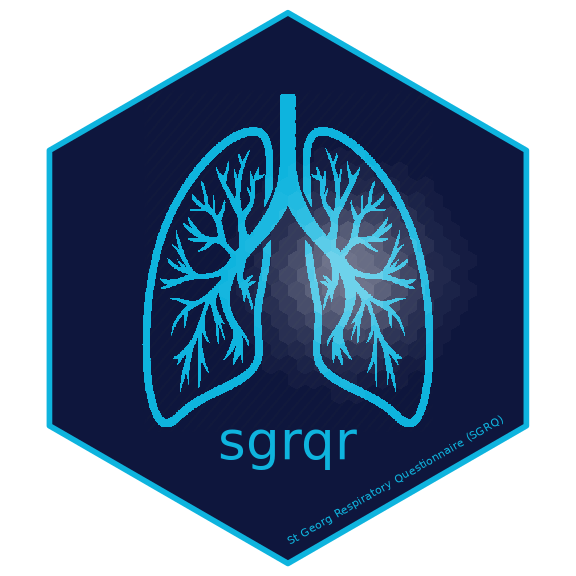

<!-- README.md is generated from README.Rmd. Please edit that file -->
`sgrqr`
=======

### Scoring the St George's Respiratory Questionnaire



Package Description
-------------------

With `score_sgrq` the package contains a function for scoring the [*St George's Respiratory Questionnaire*](http://www.healthstatus.sgul.ac.uk/SGRQ_download/Original%20English%20version.pdf) (SGRQ). In addition, `sgrqr` provides two simulated data frames containing SRI items:

-   `sgrq.full`: Data frame with no missing values;
-   `sgrq.na`: Data frame with some missing values.

Installation
------------

``` r
devtools::install_github("nrkoehler/sgrqr")
```
